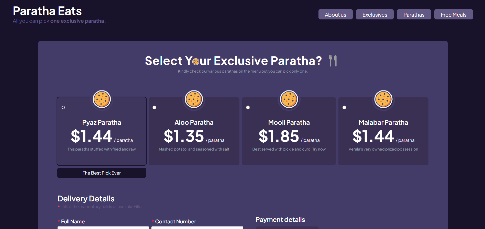
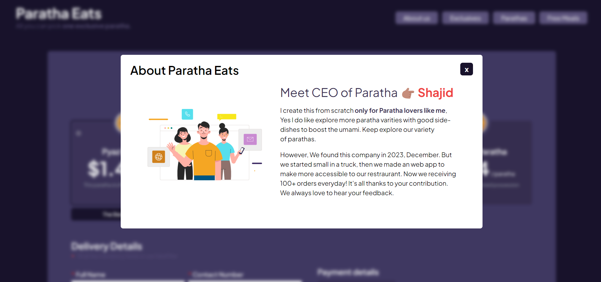
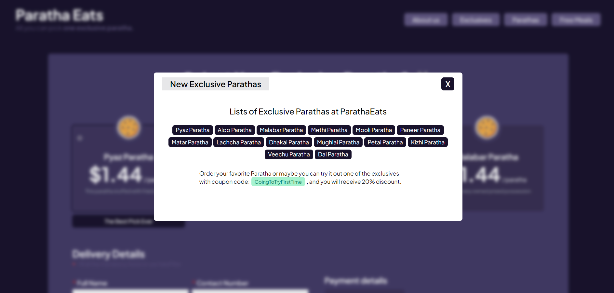
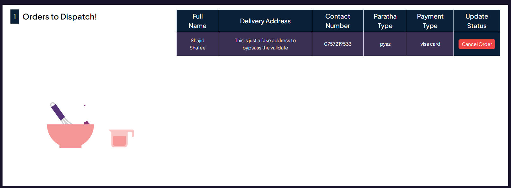

# Paratha-Eats (JavaScript DOM Project #2)

This challenge is part of free internship (Fullstack Engineer) offered by [CyberDude Networks Pvt. Ltd.](https://cyberdudenetworks.com) You can find all the source code and live links below.

> **Project #2** : Form With Local Storage Functionality
>
> This is our second project that we need to build a form and had to save it to on the localStorage and also implement the data saved from the localStorage to the webapp. However, We need to perform CRUD functionality too.

## Project Live Walkthroughs

- 🚀 Live Project URL: https://mshajid.github.io/cyberdude-challenges/javascript-dom/form-dom/dist/ (**press ctrl + click to open in a new tab**)

This project consumed around ~9 hours to complete and had to take reference from many external and internal resources. I've given you all the reference below for your convenience. 

| 💪🏽 Tech Stacks  | 🖥️ Dependencies |
|--|--|
| HTML | Just Validate |
| Tailwind CSS | UUID | 
| Vanilla JavaScript | GSAP
| Vite | Lottie

## Screenshots

## Contribution & Installation Guide
Feel free to `fork` this repository and `clone` it to your desktop. Once this process is done then open up the cloned repository with your IDE and run `npm install` to install the relevant dependencies to run this project.

run `npm run dev` to open up your local development server to check whether everything is working fine. 

> **This is must**
that make sure to create a different `branch` and add all the contribution and invoke a `pull request`.

## References

- [CyberDude Networks - JS DOM Series](https://www.youtube.com/playlist?list=PL73Obo20O_7jhOOPDASWk0PVcRxGEyrm9)
- [W3 School](https://www.w3schools.com/)
- [Stackoverflow](https://stackoverflow.com/)
- [StackEdit](https://stackedit.io/)

#### License: MIT